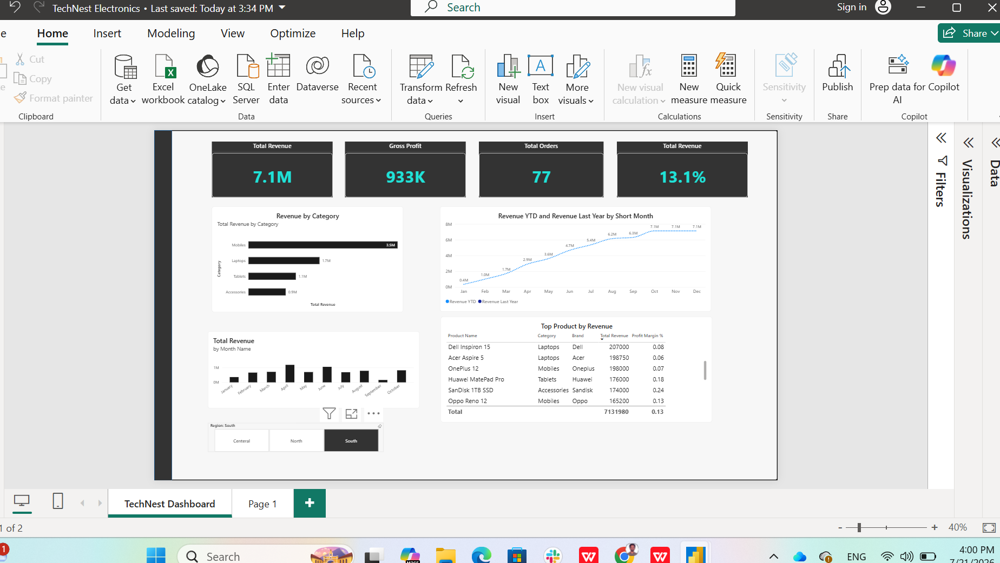

# TechNest Power BI Sales Dashboard

A professional Power BI dashboard created to analyze sales performance across products, stores, regions, and time.

## Project Overview

This project was developed using Microsoft Power BI to transform raw sales data into an interactive business intelligence dashboard. It enables users to monitor sales performance, compare key business metrics, identify top-performing products, and analyze trends over time through dynamic visualizations.

## Tools & Technologies

- Microsoft Power BI
- Power Query
- DAX (Data Analysis Expressions)
- Data Modeling
- Data Visualization
- CSV Data Sources

## Key Features

- Interactive KPI cards for Total Revenue, Gross Profit, Total Orders, and Profit Margin
- Dynamic filtering using slicers
- Revenue trend analysis over time
- Revenue comparison by product category
- Top-performing products analysis
- Year-to-Date (YTD) revenue calculation
- Previous Year revenue comparison
- Professional dashboard layout with interactive visuals

## Dashboard Preview



## Project Structure

```
TechNest-PowerBI-Dashboard/
│── Dashboard.png
│── README.md
│── TechNest-powerBI-Dashboard.pbix
│── TechNest_Sales.csv
│── TechNest_Products.csv
└── TechNest_Stores.csv
```
## Skills Demonstrated

- Data cleaning and transformation using Power Query
- Data modeling with relationships
- Writing DAX measures and calculations
- Time intelligence functions (YTD and Previous Year)
- Designing interactive dashboards
- Creating KPI cards and business metrics
- Building charts, tables, and slicers
- Applying best practices for Power BI report design

## How to Use

1. Clone or download this repository.
2. Open `TechNest-powerBI-Dashboard.pbix` using Microsoft Power BI Desktop.
3. If prompted, reconnect the CSV data sources.
4. Explore the dashboard using the available slicers and interactive visuals.